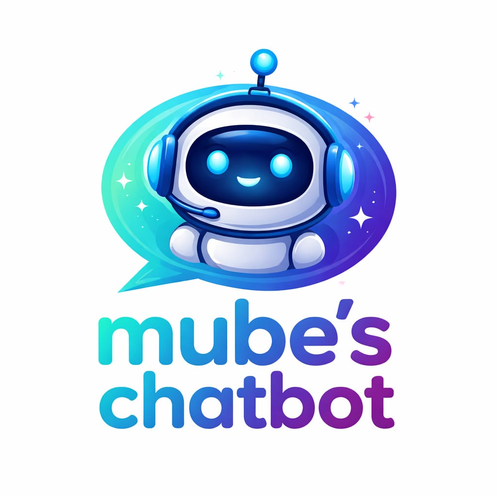

<h1>
  
  Mube's Chatbot
</h1>


A modern FastAPI + WebSocket chatbot UI powered by Groq, with live streaming responses and a clean ChatGPT-style experience.

## Features

- Real-time streaming chat via WebSockets
- Responsive centered layout
- Dark modern UI with floating composer
- Copyable code blocks in assistant responses
- Hidden scrollbars with smooth scrolling

## Tech Stack

- FastAPI + WebSocket Streaming
- Uvicorn
- Groq Python SDK

## Setup

1. Create and activate a virtual environment.
2. Install dependencies:

```bash
pip install -r requirements.txt
```

3. Create a `.env` file and add:

```env
GROQ_API_KEY=your_api_key_here
```

4. Run the app:

```bash
uvicorn app:app --reload
```

5. Open:

```text
http://127.0.0.1:8000
```

## Project Structure

```text
.
├── app.py
├── templates/
│   └── index.html
├── static/
│   ├── style.css
│   ├── script.js
│   └── mube-chat-bot-logo.jpeg
└── requirements.txt
```
